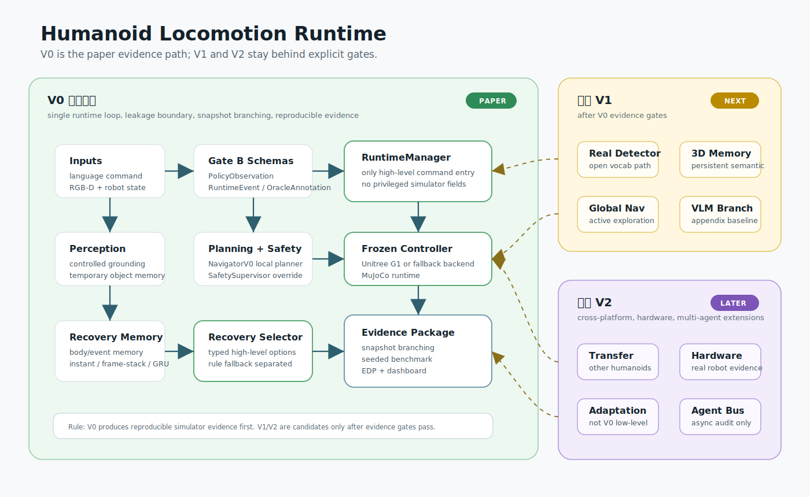
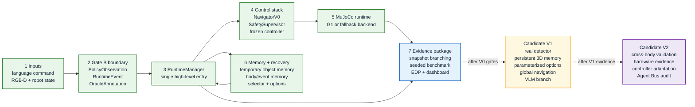

# Humanoid Locomotion Runtime

这是一个独立的人形机器人行走运行时研究项目。

白话说，它要解决的问题是：底层行走 controller 已经能让机器人站稳、走路和转向，但机器人在执行语言任务时仍会遇到目标丢失、路径被挡、定位漂移、速度跟踪变差、平衡风险等问题。这个项目要研究的是：不改底层步态控制器，只在上层判断“现在该继续、减速、停下、重新规划、重新识别目标，还是中止任务”。

当前 V0 不是做一个端到端大模型机器人，也不是训练从图像/语言直接到关节动作的 VLA。它是一个可复现的仿真实验系统：用 MuJoCo + Unitree G1 或 fallback backend，配合清晰的日志、基准测试和 Episode Data Package，研究高层恢复决策什么时候真的从 memory 中受益。

核心文档：

- [研究计划 / PRD](docs/research_plan_prd.md)
- [Gate A 工程地基记录](docs/gate_a_foundation.md)
- [Gate B schema / EDP 记录](docs/gate_b_schema_edp.md)
- [实验计划](refine-logs/EXPERIMENT_PLAN.md)
- [每日实验时间线](refine-logs/DAILY_EXPERIMENT_TIMELINE.md)
- [实验跟踪表](refine-logs/EXPERIMENT_TRACKER.md)

当前 V0 范围：

- 仿真优先：先用 MuJoCo + Unitree G1；如果 G1 controller smoke gate 过不了，优先切到 MJLab/mujocolab-compatible classic MuJoCo backend。
- 底层控制器冻结：不训练 gait、joint、actuator，也不训练 residual low-level policy。
- 只学习高层恢复选择器：supervisory recovery selector 只能从 typed recovery actions 中选动作。
- V0 主实验使用 controlled detector-like grounding：先用受控的、像检测器输出一样的数据，不把真实 open-vocabulary detector 当成主实验前提。
- 使用 temporary object memory：先做短期目标记忆，但接口要兼容未来 persistent 3D semantic memory。
- 使用 MPC / optimization local planner + SafetySupervisor：局部规划和安全兜底必须在 runtime 本地闭环里完成。
- 论文主线是诊断性研究：优先用 decision-point snapshot branching 诊断 memory 在哪些 failure profile 中改变决策并改善恢复；snapshot 未实现前只能报告 paired matched-seed diagnostic。

## 预期项目结构

上图是面向阅读的精简视觉版；下面是便于后续维护的可编辑流程版。

阶段含义：

- **V0 必须实现**：当前论文证据所需的最小闭环，包括 benchmark、leakage boundary、snapshot branching 和 EDP。
- **候选 V1**：等 V0 evidence gate 通过后再扩展，不作为当前主实验前置条件。
- **候选 V2**：跨本体、真机、底层适配或多智能体 runtime，不进入 V0 论文证据主线。
