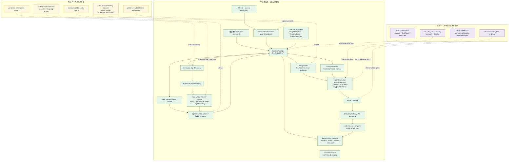

# Humanoid Locomotion Runtime

这是一个独立的 humanoid locomotion runtime 研究项目，用于构建、评估和复现实验：在成熟/冻结的人形机器人底层 locomotion controller 之上，用语言条件任务、受控开放词汇式 grounding、body/event memory、typed recovery actions 和 seeded failure benchmark 来研究高层恢复决策。

核心文档：

- [研究计划 / PRD](docs/research_plan_prd.md)
- [Gate A 工程地基记录](docs/gate_a_foundation.md)
- [实验计划](refine-logs/EXPERIMENT_PLAN.md)
- [每日实验时间线](refine-logs/DAILY_EXPERIMENT_TIMELINE.md)
- [实验跟踪表](refine-logs/EXPERIMENT_TRACKER.md)

当前 V0 范围：

- 仿真优先：MuJoCo + Unitree G1；若 G1 smoke gate 失败，切到 MuJoCo Playground humanoid backend。
- 底层控制器冻结：不训练 gait、joint、actuator 或 residual low-level policy。
- 只学习高层 supervisory recovery selector，动作空间限定为 typed recovery actions。
- V0 主实验使用 controlled detector-like grounding；真实 open-vocabulary detector 保留为 demo / V1+。
- 使用 temporary object memory，但接口保持兼容未来 persistent 3D semantic memory。
- 使用 MPC / optimization local planner + SafetySupervisor。
- 论文主线转为诊断性研究：优先用 decision-point snapshot branching 诊断 memory 在哪些 failure profile 中改变决策并改善恢复；snapshot 未实现前只能报告 paired matched-seed diagnostic。

## 预期项目结构

阶段含义：

- **V0 必须实现**：用于当前论文证据、benchmark、leakage boundary、snapshot branching 和 EDP 的最小闭环。
- **候选 V1**：在 V0 evidence gate 通过后再扩展，不作为当前主实验前置条件。
- **候选 V2**：跨本体、真机、底层适配或多智能体 runtime，不进入 V0 论文证据主线。
